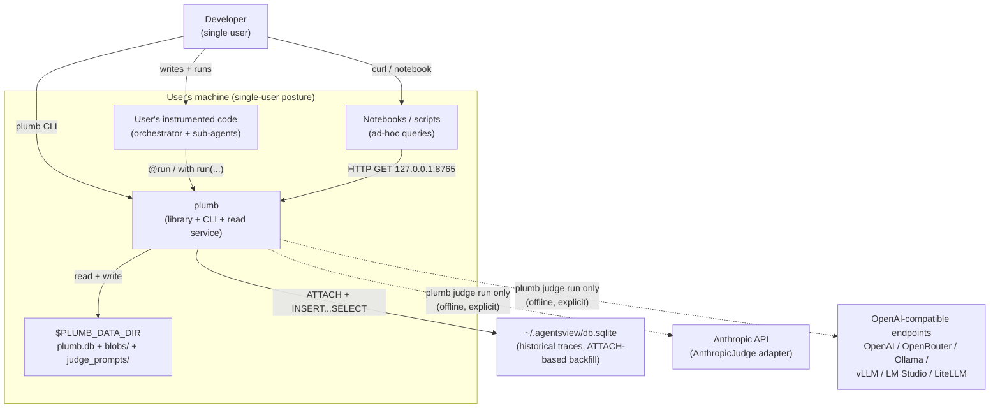
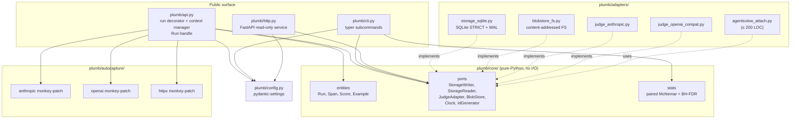
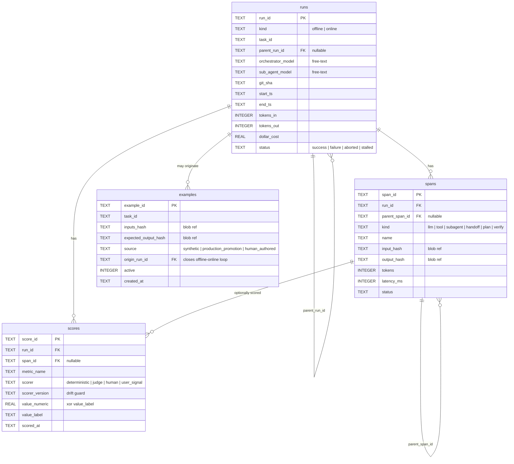
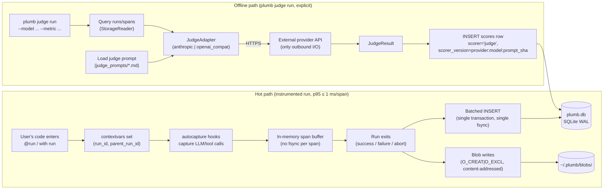
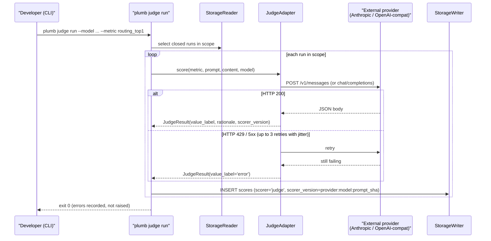
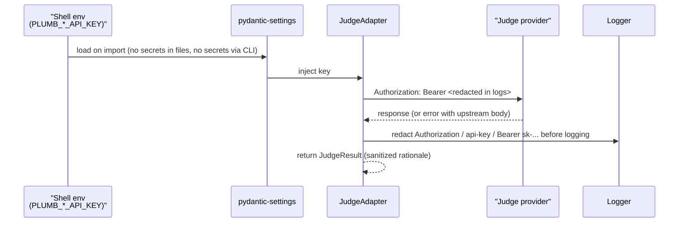
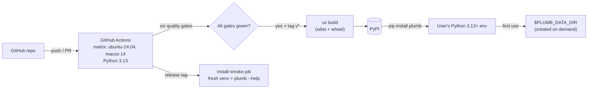

# plumb — System Design Document (SDD)

**Status:** Draft v1 — synthesized from [PRD](../1_product_and_research/PRD.md) and [TRD](TRD.md)
**Owner:** anant
**Last updated:** 2026-04-23
**Scope:** plumb v1 (Phase 1 ship, Week 6 target per PRD §8)

> **Reading order.** This SDD is the **visual, architecture-first blueprint** — what the system looks like, how the pieces fit, and which trade-offs were made. The **"why the product exists"** lives in `[../1_product_and_research/PRD.md](../1_product_and_research/PRD.md)`. The **normative "what to build" spec** (FR/NFR IDs, SQL constraints, acceptance criteria) lives in `[TRD.md](TRD.md)`. The **canonical schema + metric derivation** lives in `[../1_product_and_research/schema-and-metrics-v1.md](../1_product_and_research/schema-and-metrics-v1.md)`. This document references those; it does not restate them.

---

## 1. Problem Statement & Requirements

plumb is a measurement spine for orchestrator + sub-agent systems. It records *whether an agent actually worked* for a developer — acceptance, routing, handoff, cost, latency, reliability — across both offline evaluation runs and online production traces, in one unified four-table SQLite schema. The product exists to close three instrumentation gaps (per [PRD §1](../1_product_and_research/PRD.md)): acceptance is invisible in current agent-telemetry tools, orchestrator-specific failures are uncategorized, and offline/online live in different tools.

Three audiences share one artifact (per [PRD §3](../1_product_and_research/PRD.md)): DevEx teams (intervention rate + routing quality on real dev work), AI/ML engineers (four-table schema + statistical rigor for model-swap decisions), and agentic-systems teams (orchestrator routing + handoff round-trip + MAST-aligned span tree). The architecture is shaped by six hard technical constraints that fall out of the PRD and TRD:

- **Four tables, no fifth.** `runs`, `spans`, `scores`, `examples`. Schema shape is the thesis ([PRD §5](../1_product_and_research/PRD.md)).
- **Two Python entry points, no third.** Decorator + context manager only ([PRD §7 non-goal](../1_product_and_research/PRD.md), [TRD FR-API-1](TRD.md)).
- **Zero synchronous network I/O on the hot path.** Judges run offline only ([TRD NFR-Perf-5](TRD.md)).
- **Zero schema migrations after Week 4.** Any schema change = v2 ([PRD §8 Tier-1](../1_product_and_research/PRD.md), [TRD DATA-MIG-1](TRD.md)).
- **Single-user local.** No SaaS, no multi-tenant, no auth, no streaming ([PRD §7](../1_product_and_research/PRD.md)).
- **Small enough to read in an afternoon.** ~2–3k LOC of pure Python ([TRD §1](TRD.md)).

Everything below is how these constraints shape components, data flow, and trade-offs.

---

## 2. High-Level Architecture Overview

The 30,000-foot view: plumb is a Python library installed into the developer's own Python process, backed by a single SQLite file and a content-addressed blob directory under `$PLUMB_DATA_DIR` (default `~/.plumb/`). It exposes three surfaces — Python API, CLI, and a loopback HTTP read service. Outbound network calls happen **only** from judge adapters, and only when the user explicitly invokes `plumb judge run`.




The dashed lines to judge providers emphasize that outbound network I/O is **never on the instrumented hot path** — it only occurs when the developer explicitly runs `plumb judge run` from the CLI ([TRD NFR-Perf-5](TRD.md)).

---

## 3. System Components & Services

plumb uses a **ports-and-adapters** layout (a recognized expression of Clean Architecture) rather than a literal `domain/application/infrastructure` three-folder split. Rationale is in [§10 Trade-offs](#10-trade-offs--alternatives) and [TRD §5.3 Assumption 1](TRD.md); this choice was sanctioned as part of the SDD sign-off and reflected in `[../../CLAUDE.md](../../CLAUDE.md)`.

### 3.1 Component diagram




### 3.2 Component responsibilities


| Component                               | Responsibility                                                                                                                                                                                                           | Normative anchor                                |
| --------------------------------------- | ------------------------------------------------------------------------------------------------------------------------------------------------------------------------------------------------------------------------ | ----------------------------------------------- |
| `plumb/core/`                           | Pure-Python entities, ports (Protocols), and stats helpers. No I/O, no network, no SDK imports. `mypy --strict` clean.                                                                                                   | [TRD NFR-Use-3](TRD.md)                         |
| `plumb/api.py`                          | Public `run` callable (decorator + context manager, sync + async). Owns contextvars for run nesting and `parent_run_id` propagation. Exposes `Run` handle with `add_score`, `add_span`, `set_models`, `abort`.           | [TRD FR-API-1..4](TRD.md), [FR-GRAPH-1](TRD.md) |
| `plumb/autocapture/`                    | Import-time monkey-patch installers for `anthropic`, `openai`, `httpx`. Opt-out via `PLUMB_AUTOCAPTURE=0`. Must not mutate caller-visible SDK behaviour.                                                                 | [TRD FR-CAP-1..3](TRD.md)                       |
| `plumb/adapters/storage_sqlite.py`      | Implements `StorageWriter`/`StorageReader` ports. Owns SQLite connection pragmas (`journal_mode=WAL`, `synchronous=NORMAL`, `busy_timeout=5000`, `foreign_keys=ON`), STRICT table creation, batched INSERT on run close. | [TRD §7.1](TRD.md), [NFR-Perf-3/4](TRD.md)      |
| `plumb/adapters/blobstore_fs.py`        | Content-addressed filesystem blob store at `$PLUMB_DATA_DIR/blobs/<ab>/<cdef…>`. `O_CREAT\|O_EXCL` writes, mode `0600`/`0700`.                                                                                            | [TRD DATA-BLOB-1..5](TRD.md)                    |
| `plumb/adapters/judge_anthropic.py`     | Native Anthropic SDK adapter. Prompt caching, explicit betas. Off the hot path — only used by `plumb judge run`.                                                                                                         | [TRD INT-JUDGE-1](TRD.md)                       |
| `plumb/adapters/judge_openai_compat.py` | Single adapter covering OpenAI + OpenRouter + Ollama + vLLM + LM Studio + LiteLLM via configurable `base_url`. Chat-completions protocol.                                                                                | [TRD INT-JUDGE-2](TRD.md)                       |
| `plumb/adapters/agentsview_attach.py`   | ATTACH-based idempotent backfill from `~/.agentsview/db.sqlite`. ≤ 200 LOC (tests + SQL excluded). Fails loudly on schema drift.                                                                                         | [TRD INT-ATTACH-1..5](TRD.md)                   |
| `plumb/cli.py`                          | `typer`-driven CLI: `run stats`, `score write`, `example promote`, `judge run`, `serve`, `attach`, `version`.                                                                                                            | [TRD FR-CLI-1..3](TRD.md)                       |
| `plumb/http.py`                         | FastAPI read-only service bound to `127.0.0.1:8765`. Five `GET` endpoints; no write routes.                                                                                                                              | [TRD FR-HTTP-1..3](TRD.md)                      |
| `plumb/config.py`                       | `pydantic-settings` for all env-var config (`PLUMB_DATA_DIR`, judge keys, autocapture flag).                                                                                                                             | [TRD NFR-Sec-1](TRD.md)                         |


### 3.3 Dependency rule

Arrows point **inward** to `plumb/core/`. `plumb/core/` never imports from adapters, `plumb/api.py`, `plumb/cli.py`, or `plumb/http.py`. Adapters depend on ports (Protocols) declared in `plumb/core/ports.py`; ports never depend on adapters. This makes the seams testable (in-memory fakes for every port) and swappable (DuckDB/Postgres storage, Luna-2-style SLM judges) without touching the core.

---

## 4. Data Architecture

### 4.1 Data models (high-level ERD)

The four tables, three foreign keys, and the single bidirectional lineage link. Concrete SQL types, `CHECK` constraints, and indexes live in [TRD §7.1](TRD.md); the rationale for each column lives in `[../1_product_and_research/schema-and-metrics-v1.md](../1_product_and_research/schema-and-metrics-v1.md)`.




Three design moves carry the framework:

- `**runs.kind**` unifies offline evals and production traces in one table — the Braintrust/LangSmith consensus shape.
- `**scores.scorer` + `scores.scorer_version**` make judge, human, deterministic, and user-signal scores structurally identical, and enable judge-drift detection without corrupting history.
- `**examples.origin_run_id**` is the single foreign key that closes the offline ↔ online loop: a production failure promoted to a regression case remembers the trace it came from.

### 4.2 Data flow

Two primary flows, both on the local machine. The **instrumented-run capture flow** is latency-sensitive (p95 ≤ 1 ms per span, [TRD NFR-Perf-1](TRD.md)); the **judge scoring flow** is explicitly off the hot path and runs only when the developer invokes `plumb judge run`.




Four properties this flow guarantees:

1. **No network I/O on run open, span capture, or run close** — the hot path only touches `plumb.db` and `blobs/`.
2. **Span writes are buffered in memory and flushed in one transaction** — single fsync per run close, not per span ([TRD NFR-Perf-4](TRD.md)).
3. **Process-kill safety** — flushed spans survive SIGKILL; `end_ts IS NULL` runs older than 1 hour are marked `status='stalled'` on next startup ([TRD FR-EDGE-2](TRD.md), [NFR-Rel-2](TRD.md)).
4. **Judge errors never fail the instrumented code** — `plumb judge run` writes a `scores` row with `value_label='error'` on provider failure and moves on ([TRD INT-JUDGE-5](TRD.md)).

### 4.3 Storage strategy


| Store                                       | Choice                                                                                               | Rationale                                                                                                                                                                                                                                               |
| ------------------------------------------- | ---------------------------------------------------------------------------------------------------- | ------------------------------------------------------------------------------------------------------------------------------------------------------------------------------------------------------------------------------------------------------- |
| Primary rows                                | SQLite STRICT tables in WAL mode, single file at `$PLUMB_DATA_DIR/plumb.db`                          | Zero-ops, single-user, four small tables. STRICT gives type safety; WAL gives the multi-reader/one-writer concurrency we actually need. ATTACH makes `agentsview` backfill a ~200 LOC adapter with no ETL ([TRD §7.1](TRD.md), [INT-ATTACH-1](TRD.md)). |
| Large content (prompts, tool args, outputs) | Content-addressed filesystem blob store at `blobs/<sha256[0:2]>/<sha256[2:]>`, fan-out by first byte | Keeps PII out of the main row; dedup is free (same content → same hash → same path); `O_CREAT\|O_EXCL` is atomic and idempotent ([TRD DATA-BLOB-1..5](TRD.md)).                                                                                          |
| Judge prompts                               | `judge_prompts/*.md` under `$PLUMB_DATA_DIR`, versioned in git                                       | `scorer_version = {provider}:{model}:{prompt_sha}` requires a stable SHA source. Git gives history + rollback for free ([TRD INT-JUDGE-6](TRD.md)).                                                                                                     |
| Config                                      | Environment variables via `pydantic-settings`                                                        | No config files shipped; `PLUMB_DATA_DIR` env var is the single configuration knob ([TRD NFR-Sec-1](TRD.md)).                                                                                                                                           |


What we explicitly do **not** use: Redis, Postgres, DuckDB, S3, Kafka, OpenSearch, read replicas, partitioning (see [PRD §7](../1_product_and_research/PRD.md), [TRD §6.3](TRD.md)). These would all be architecturally sound but they buy us nothing at single-user scale and would cost us the "adopt in an afternoon" property from [PRD §1](../1_product_and_research/PRD.md).

---

## 5. API Design Strategy

plumb has three API surfaces, each with a different interaction pattern, bound by the constraint that the Python API is the only place writes happen on the hot path.


| Surface              | Pattern                                               | Who calls it                                | Writes?                                                 |
| -------------------- | ----------------------------------------------------- | ------------------------------------------- | ------------------------------------------------------- |
| Python (`plumb.run`) | Decorator + context manager over sync/async functions | User's instrumented code                    | Yes (hot path)                                          |
| CLI (`plumb …`)      | `typer` subcommands, stdout JSON/table                | Developer in a terminal                     | Yes (out-of-band: scores, examples, judge runs, attach) |
| HTTP (`GET /…`)      | Read-only REST, `application/json`, Pydantic v2       | Notebooks, ad-hoc scripts, local dashboards | **No** — all writes go through Python API or CLI        |


Rationale for three surfaces instead of one: the Python API is the only thing that can give 1 ms overhead for instrumentation; the CLI is the only thing that makes `plumb judge run` a scheduled/batch tool; HTTP is the only thing notebooks can reach without importing plumb. Keeping writes out of the HTTP surface (FR-HTTP-2) means the loopback service can stay auth-free without exposing a mutation path.

### 5.1 Critical flow: orchestrator → sub-agent → handoff → run close

This is the most load-bearing sequence in the system — it exercises nested runs, hand-off spans, contextvars propagation, buffered spans, and batch flush.

```mermaid
sequenceDiagram
    participant User as User code
    participant Orch as "@run orchestrator()"
    participant CV as contextvars
    participant Sub as "@run subagent()"
    participant AC as autocapture
    participant Buf as in-memory buffer
    participant SQL as "SQLite (WAL)"
    participant BS as blob store

    User->>Orch: orchestrator(task)
    Orch->>CV: set run_id=R1, parent_run_id=None
    Orch->>Buf: buffer starts (R1)
    Orch->>Sub: call subagent(brief)
    Sub->>CV: read parent_run_id=R1
    Sub->>CV: set run_id=R2, parent_run_id=R1
    Sub->>Buf: buffer starts (R2)
    Sub->>AC: anthropic.messages.create(...)
    AC->>Buf: append span (kind=llm, run_id=R2)
    Sub-->>Orch: return summary
    Sub->>BS: write brief + summary blobs (O_CREAT|O_EXCL)
    Sub->>Buf: append span (kind=handoff, input_hash=brief, output_hash=summary)
    Sub->>SQL: BEGIN; INSERT runs R2; INSERT spans; COMMIT (one fsync)
    Sub->>CV: restore parent contextvars
    Orch->>Buf: append span (kind=subagent, name="subagent")
    Orch->>SQL: BEGIN; INSERT runs R1; INSERT spans; COMMIT (one fsync)
    Orch-->>User: return result
```


Key properties visible in the flow:

- `runs.parent_run_id` is populated automatically via contextvars — no user wiring required ([TRD FR-GRAPH-1](TRD.md)).
- Cross-process parenting requires explicit `parent_run_id=` argument (plumb does not inject across subprocess boundaries; [TRD FR-GRAPH-2](TRD.md)).
- Hand-offs are spans of `kind='handoff'` on the parent run, with `input_hash` (brief) and `output_hash` (summary). The round-trip QA probe for the `handoff_roundtrip` metric reads these from the blob store ([TRD FR-GRAPH-3](TRD.md)).
- Each run close is one transaction, one fsync — no per-span fsync ([TRD NFR-Perf-4](TRD.md)).

### 5.2 Secondary flow: `plumb judge run`

Offline-only, explicitly off the hot path, fail-open on provider errors.




---

## 6. Technology Stack

All choices inherit from [TRD §5.4](TRD.md); this table adds one-line rationale per choice.


| Category                         | Choice                                                                     | Version floor | Why this over alternatives                                                                                                                                   |
| -------------------------------- | -------------------------------------------------------------------------- | ------------- | ------------------------------------------------------------------------------------------------------------------------------------------------------------ |
| Language / runtime               | Python                                                                     | 3.13+         | `typing.Self`, `typing.LiteralString`, `except*` syntax, and perf assumptions all depend on 3.13 ([TRD §5.3 Assumption 2](TRD.md)).                          |
| Primary store                    | SQLite                                                                     | 3.38+         | STRICT tables (3.37+) + JSON1 (bundled 3.38+); ships on all modern OSs; ATTACH is the backfill primitive. Postgres/DuckDB would add an operator requirement. |
| Model validation                 | `pydantic`                                                                 | 2.6+          | Entity validation + API schemas, single library covers both; Pydantic v1 APIs explicitly forbidden in `[../../CLAUDE.md](../../CLAUDE.md)`.                  |
| Config                           | `pydantic-settings`                                                        | 2.2+          | Env-var driven, no config files; matches [TRD NFR-Sec-1](TRD.md).                                                                                            |
| CLI framework                    | `typer`                                                                    | 0.12+         | Type-hint-driven commands; thin wrapper on `click` with less boilerplate.                                                                                    |
| HTTP server                      | `fastapi` + `uvicorn`                                                      | 0.115 / 0.30  | Read-only surface with Pydantic-native response models; loopback binding is trivial.                                                                         |
| Anthropic judge SDK              | `anthropic`                                                                | 0.40+         | Prompt caching for stable judge prompts; explicit beta headers when needed.                                                                                  |
| OpenAI-compatible judge SDK      | `openai`                                                                   | 1.50+         | One SDK covers OpenAI / OpenRouter / Ollama / vLLM / LM Studio / LiteLLM via `base_url`; they all speak chat-completions.                                    |
| HTTP client (autocapture target) | `httpx`                                                                    | transitive    | Standard for modern Python SDKs; autocapture monkey-patches it as the tool-call transport ([TRD FR-CAP-1](TRD.md)).                                          |
| Pretty CLI output                | `rich` *(opt)*                                                             | 13+           | Terminal tables when stdout is a TTY; degrade to JSON otherwise.                                                                                             |
| Test framework                   | `pytest` + `pytest-asyncio` + `pytest-cov` + `hypothesis` + `pytest-httpx` | —             | Property tests for schema invariants; `pytest-httpx` mocks judge APIs in CI.                                                                                 |
| Lint / type                      | `ruff` + `mypy`                                                            | current       | `ruff check/format` is CI-blocking; `mypy --strict` on `plumb/core/` only ([TRD NFR-Use-2/3](TRD.md)).                                                       |
| Packaging                        | `uv` (primary), `pip` (fallback)                                           | current       | Matches `[../../CLAUDE.md](../../CLAUDE.md)` quick-start; `uv build/publish` for PyPI.                                                                       |


---

## 7. Scalability & Performance Strategy

plumb does not scale horizontally — it scales **per-instance** because every instance is a single developer on a single machine. The scalability question here is "do our per-process budgets hold?", not "do we add more nodes?".

### 7.1 Per-instance budgets


| Budget                  | Target                                                              | Strategy                                                                                                                                           |
| ----------------------- | ------------------------------------------------------------------- | -------------------------------------------------------------------------------------------------------------------------------------------------- |
| Span capture (hot path) | p95 ≤ 1 ms per span over 10k no-op spans ([TRD NFR-Perf-1](TRD.md)) | In-memory span buffer; no fsync per span; contextvars (not thread locks); zero synchronous network I/O on the hot path ([TRD NFR-Perf-5](TRD.md)). |
| Run close               | p95 ≤ 50 ms for runs with ≤ 100 spans ([TRD NFR-Perf-2](TRD.md))    | Single transaction, single fsync; batched INSERT; pragmas set once per connection.                                                                 |
| Cold import             | ≤ 200 ms ([TRD NFR-Perf-6](TRD.md))                                 | Lazy-import adapters from inside functions; keep `plumb/core/` import-light; no eager SDK imports in `plumb.__init__`.                             |


### 7.2 SQLite concurrency posture

SQLite in WAL mode + `PRAGMA busy_timeout=5000` supports one writer and many concurrent readers. In plumb's typical shape, writers are run-close flushes (milliseconds each) and readers are `plumb run stats`, the HTTP read service, and notebooks — a workload SQLite handles trivially. `PRAGMA foreign_keys=ON` is set on every connection (SQLite defaults to OFF). No connection pooling beyond what the `sqlite3` stdlib gives us per-process.

### 7.3 Blob store sizing

Blobs are fanned out by the first byte of their sha256 hash, giving 256 top-level directories. Expected v1 scale is ≤ 10k blobs after 8 weeks of instrumentation (PRD Tier-1 target: ≥ 30 runs at v1, ≥ 100 at v2), which is ~40 files per subdir — well under any filesystem inode-listing concerns. No further partitioning is needed; if v2 scale grows 100× we add a second level of fan-out with zero schema impact.

### 7.4 What we explicitly do not scale

- **No horizontal scaling.** Single-user SQLite file is the constraint ([PRD §7](../1_product_and_research/PRD.md)).
- **No read replicas.** One file, one process, all queries local.
- **No sharding.** `runs.run_id` is a sha-derived TEXT PK; global uniqueness is a hash, not a partition key.
- **No async work queue.** `plumb judge run` is a foreground CLI command; scheduling is the user's `cron` / GitHub Actions cron.

If the "single-user local" constraint ever drops (an explicit [PRD §7](../1_product_and_research/PRD.md) non-goal), the scaling story has to be redesigned. That's a v2+ conversation and would live in `[deferred-features.md](deferred-features.md)`.

---

## 8. Security Architecture

plumb's security posture follows directly from its deployment posture: single user, loopback only, no server-side state shared with anyone else. The architecture here is defensive about the things that can still leak — secrets in logs, file modes on the blob store, SQL injection, and accidental non-loopback binding.

### 8.1 Secrets handling




- Secrets come from env vars only via `pydantic-settings` ([TRD NFR-Sec-1](TRD.md)). Never from files, never from CLI args.
- Adapter logging redacts `authorization`, `api-key`, and `Bearer sk-…`-style headers before any request/response goes to a logger ([TRD NFR-Sec-2](TRD.md)).
- A CI grep for common secret patterns (`AKIA`, `sk-`, `anthropic_api_key`) runs against committed code as a backstop.

### 8.2 Data protection at rest

- Blob files are created mode `0600`; `$PLUMB_DATA_DIR` is created mode `0700` ([TRD NFR-Sec-5](TRD.md)). Prevents other local users on a shared machine from reading plumb's content.
- At-rest *encryption* is delegated to the OS (FileVault / LUKS / BitLocker). plumb does not ship its own crypto.
- The blob store is content-addressed (sha256) — blob names leak length of content but not plaintext.

### 8.3 Network posture

- HTTP service (`plumb serve`) binds `127.0.0.1:8765` by default; binding `0.0.0.0` requires an explicit `--host` flag with a warning log on startup ([TRD FR-HTTP-1](TRD.md), [NFR-Sec-4](TRD.md)).
- No authentication layer is implemented, and this is intentional, not a gap: loopback-only + single-user machine + read-only endpoints + no mutation routes = an acceptable posture for [PRD §7](../1_product_and_research/PRD.md)'s "No SaaS, single-user" constraint. This is sanctioned in [TRD §5.3 Assumption 3](TRD.md).
- No telemetry, no auto-update checks, no usage pings — the only outbound connections are judge API calls initiated by explicit `plumb judge run` ([TRD NFR-Sec-6](TRD.md)).

### 8.4 SQL injection prevention

- All SQL is parameterized; string concatenation into SQL is prohibited and enforced by `ruff` rule `S608` ([TRD NFR-Sec-3](TRD.md)).
- Table/column names are never derived from user input — they are baked into `plumb/adapters/storage_sqlite.py`.

### 8.5 Supply chain

- Dependencies are pinned in `uv.lock`; dependabot PRs auto-merge when CI is green ([TRD §11.5](TRD.md)).
- No bundled C extensions beyond what Python stdlib and the vetted deps pull in.

---

## 9. Deployment Architecture

plumb is a library, not a service, so "deployment" here is "how the wheel reaches PyPI" rather than "how a service reaches prod".




### 9.1 Distribution

- **Build:** `uv build` produces sdist + wheel in `dist/` ([TRD §11.1](TRD.md)).
- **Publish:** `uv publish` to PyPI on tag push; Twine is the fallback.
- **Versioning:** semver. v0.1 at Phase 1. Pre-1.0 allows minor schema *additions*; any schema-breaking change is a major bump and requires the `plumb migrate` path ([TRD §7.4](TRD.md)).

### 9.2 Environments

There is no dev/staging/prod split for the library itself. The developer's machine is simultaneously dev, test, and prod. The only non-developer environment is CI.

### 9.3 CI gates

Six gates must pass pre-merge to `main` (all wired into GitHub Actions per [TRD §10.2](TRD.md)):

1. `ruff check .` — zero errors.
2. `ruff format --check .` — zero diffs.
3. `mypy --strict plumb/core/` — zero errors.
4. `pytest` including the `tests/perf/` reference benchmark (NFR-Perf-1).
5. Coverage threshold: `pytest --cov=plumb --cov-fail-under=75`.
6. Public-API docstring coverage: `interrogate --fail-under 95 plumb/api.py plumb/cli.py plumb/http.py`.

A seventh **install-smoke** job runs on every release tag: fresh Python 3.13 venv, `pip install plumb==<tag>`, `plumb --help && plumb version && <minimal @run smoke>`. Fails the release on smoke failure.

### 9.4 What we do not deploy

No Docker image, no Kubernetes manifests, no Helm chart, no systemd unit, no Terraform. The stale `[docker-compose.yml](../../docker-compose.yml)` at the repo root is slated for removal/rewrite per [TRD §8.5](TRD.md) — it pre-dates this TRD/SDD round and does not reflect plumb's actual shape.

---

## 10. Trade-offs & Alternatives

Five architectural decisions that shaped plumb v1. Each is "chosen / alternatives / rationale".

### 10.1 Ports-and-adapters vs. literal three-folder Clean Architecture

- **Chosen:** `plumb/core/` (entities + ports), `plumb/adapters/`* (storage, blobs, judges, attach), `plumb/api.py`, `plumb/cli.py`, `plumb/http.py`, `plumb/autocapture/`, `plumb/config.py`.
- **Alternatives:** literal `src/domain/`, `src/application/`, `src/infrastructure/` split as described in `[../../CLAUDE.md](../../CLAUDE.md)`.
- **Rationale:** plumb is ~2–3k LOC and its "business logic" is schema writes + SQL queries + statistics helpers. A strict three-layer split with per-use-case classes, DTOs, and mappers would roughly double the boilerplate-per-feature without improving the seams that actually matter. The seams that matter — swappable storage, swappable judges, swappable adapter sources — are preserved via Protocols in `plumb/core/ports.py`. Published Python libraries in the same weight class (`requests`, `httpx`, `pydantic`, `openai`, `anthropic`, `sqlalchemy`) all use capability-based layout, not three-folder splits. This deviation is flagged in [TRD §5.3 Assumption 1](TRD.md); `../../CLAUDE.md` is being updated in this same change to record plumb's actual layout and the principles that still apply.

### 10.2 SQLite vs. Postgres vs. DuckDB

- **Chosen:** SQLite (STRICT tables, WAL, single file).
- **Alternatives:** Postgres (mature, concurrent), DuckDB (columnar, great for analytics).
- **Rationale:** zero-ops matters more than any database feature. SQLite ships on every OS, has no server process, survives power loss via WAL, and — critically — supports `ATTACH DATABASE`, which reduces the `agentsview` backfill adapter to ~200 LOC of pure SQL ([TRD INT-ATTACH-1](TRD.md), [PRD §6](../1_product_and_research/PRD.md)). Postgres and DuckDB are both good; neither gives us a win at single-user scale and both cost us the "adopt in an afternoon" property. DuckDB specifically is a tempting analytics win but it can't substitute for transactional WAL writes on the hot path.

### 10.3 One `openai_compat` adapter vs. per-provider adapters

- **Chosen:** single `OpenAICompatibleJudge` with configurable `base_url`, covering OpenAI + OpenRouter + Ollama + vLLM + LM Studio + LiteLLM.
- **Alternatives:** separate adapters per provider.
- **Rationale:** they all speak the same chat-completions protocol; differences are URL and auth token. One adapter is testable against one mock server; per-metric model overrides (`PLUMB_JUDGE_MODEL_<METRIC>`) are orthogonal and work across providers ([TRD INT-JUDGE-2/3](TRD.md)). The separate `AnthropicJudge` exists only because the Anthropic SDK has provider-specific features (prompt caching, beta headers) we want to keep first-class for stable judge prompts ([TRD INT-JUDGE-1](TRD.md)).

### 10.4 After-the-fact judging vs. inline guardrails

- **Chosen:** judges run only via explicit `plumb judge run`, never on the instrumented hot path.
- **Alternatives:** Galileo/Patronus-style inline runtime blocking, with synchronous judge calls during the user's run.
- **Rationale:** this is a philosophy split, not a research question (`[../1_product_and_research/schema-and-metrics-v1.md](../1_product_and_research/schema-and-metrics-v1.md#where-research-converges-where-it-splits)`). Inline guardrails would add hundreds of ms of network latency to every captured span, blowing the 1 ms budget ([TRD NFR-Perf-1/5](TRD.md)). plumb's thesis is that after-the-fact eval with `scorer_version` drift detection is the right default for a measurement spine; teams who need runtime blocking can layer it on top without touching plumb's schema.

### 10.5 Contextvars + monkey-patch vs. OpenTelemetry instrumentation

- **Chosen:** `contextvars` for run/span nesting; import-time monkey-patch installers for `anthropic`, `openai`, `httpx`.
- **Alternatives:** emit OpenTelemetry spans and rely on OTel-aware auto-instrumentation.
- **Rationale:** plumb's schema is not OTel-shaped — `runs.kind`, `scores.scorer_version`, and `examples.origin_run_id` are the load-bearing fields, and none of them have OTel semantic convention analogues. OTel would also pull in a chunky dependency tree that threatens the ≤ 200 ms cold-import budget ([TRD NFR-Perf-6](TRD.md)). OTel *export* remains a reasonable v2 interop path as an additional adapter (see [§12 Future Considerations](#12-future-considerations)) — but as the primary instrumentation mechanism it's the wrong shape for v1.

---

## 11. Risks & Mitigation

Architecture-level risks. Mirrors [TRD §12.2](TRD.md) but focused on the risks that specifically shape component boundaries or data flow.


| Risk                                                                   | Architectural mitigation                                                                                                                                                                                         |
| ---------------------------------------------------------------------- | ---------------------------------------------------------------------------------------------------------------------------------------------------------------------------------------------------------------- |
| Hot-path overhead exceeds 1 ms/span (NFR-Perf-1)                       | In-memory span buffer + single fsync per run close + zero synchronous network I/O on hot path. Reference benchmark in CI (`tests/perf/test_span_overhead.py`).                                                   |
| Schema evolves despite zero-migration goal                             | Ports-and-adapters: adding an adapter or a use case never touches `plumb/core/` or the schema. Schema change requires TRD revision and a major version bump ([TRD §7.4](TRD.md)).                                |
| Judge quality regression (Sonnet 4.6 on routing-top-1)                 | `scorer_version = {provider}:{model}:{prompt_sha}` on every judge row; prompt SHA pins exact prompt; drift detectable in SQL without corrupting history.                                                         |
| `agentsview` schema drift breaks ATTACH adapter                        | Adapter fails loudly with a named-column error rather than silently dropping data ([TRD INT-ATTACH-4](TRD.md)); 1-hour migration path, not a redesign.                                                           |
| Secrets leaked via error messages or logs                              | Adapter-level header redaction + CI grep for common key patterns; secrets only via env vars through `pydantic-settings`, never via CLI or files.                                                                 |
| Third entry point (plugin system, middleware, subclass hook) sneaks in | Surface is normative and enforced by test: `test_public_surface.py` enumerates `plumb.`* and fails if any callable beyond `run` is exported for instrumentation ([TRD AC-API-1](TRD.md)).                        |
| Process kill mid-run corrupts data                                     | SQLite WAL + explicit transaction commit on close guarantees flushed spans survive SIGKILL; startup stale-run detector marks `end_ts IS NULL` older than 1 hour as `status='stalled'` ([TRD FR-EDGE-2](TRD.md)). |
| Non-loopback binding via `--host` in a shared environment              | `plumb serve --host <non-loopback>` emits a warning log on startup; documented as out-of-posture and user-owned ([TRD FR-HTTP-1](TRD.md)).                                                                       |


---

## 12. Future Considerations

Forward-compatibility seams deliberately preserved so that v1.1 / v2 work does not require schema migration. Each bullet references where the seam sits in the architecture.

- **Long-running agents (v2).** `spans.parent_span_id` + `runs.parent_run_id` already support arbitrary nesting. Subgoal annotation can land as a new `spans.kind='plan'` usage pattern + a `scores` row per subgoal — no schema change.
- **Surveys, ESM prompts, cost ledgers (v1.1+).** [PRD §7](../1_product_and_research/PRD.md) forbids a fifth table; the seams to absorb these are `runs.kind='survey'` and `scores.scorer='user_signal'`. Both are already allowed by existing `CHECK` constraints.
- **Alternative storage backends (v2).** `plumb/core/ports.py` declares `StorageWriter` and `StorageReader` Protocols. DuckDB or Postgres backends are drop-in alternates; `plumb/adapters/storage_*.py` is where they'd land.
- **SLM judges at 100% coverage (v2).** `JudgeAdapter` accepts anything that satisfies the `score(metric, prompt, content, model) → JudgeResult` shape. Luna-2-style small-LM evaluators drop in as a third adapter without touching core.
- **OpenTelemetry export (v2).** As an *additional* adapter emitting OTel spans from plumb spans — not a replacement for plumb's schema. This keeps `runs.kind` + `scores.scorer_version` intact while gaining interop with OTel-aware dashboards.
- **Plan-vs-execution attribution (v1.1).** Requires no schema change: a `scores` row with `scorer='judge'`, `metric_name='attribution'`, and `value_label ∈ {'plan_failure','execution_failure'}` suffices. The counterfactual re-run is a separate `runs.kind='offline'` entry linked via `parent_run_id`.
- **MAST 14-mode failure tagging (v1.1).** Lands as `scores` rows with `metric_name='mast_failure_mode'` and `value_label` ∈ the 14-mode taxonomy. Schema-compatible.

Deferred items (options considered but not shipping in v1) are tracked in `[deferred-features.md](deferred-features.md)`. The canonical rule: if a future feature requires a fifth table or a third public entry point, it is a major version change, not a v1 extension.

---

*End of SDD v1.*